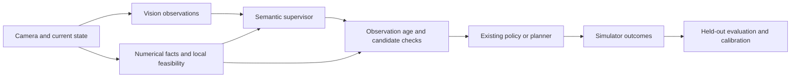

# Jev + Autonomous Driving

**Structured semantic decisions for driving recovery and replanning.**

[Research plan](docs/research-plan.md) · [Recorded-image experiments](experiments/README.md) · [First diagnostic results](docs/first-probe.md)

JevDrive tests where Jev can help an existing driving policy choose **continue, observe, replan, or defer**. A local controller and feasibility checks own vehicle execution. Jev receives structured text; a separate vision model processes camera images.

**Status: working research prototype.** The live Jev client, recorded-image comparison, response gate, and evaluation utilities are implemented. A 27-image GPU diagnostic has been run. CARLA/BeamNG closed-loop integration, outcome calibration, and driving-performance improvements are **not yet demonstrated**.

## First measured result

On 27 recorded simulator images from 9 source groups, using Qwen2.5-VL-7B on one RTX 4090 and Jev 1.13.0:

| Decision path | Successful attempts | Median decision stage | Median pipeline per image |
| --- | ---: | ---: | ---: |
| Qwen image → one-token choice scoring | 54 / 54 | 267 ms | 275 ms |
| Qwen description → Qwen one-token choice scoring | 54 / 54 | 94 ms | 2,848 ms |
| Qwen description → Jev | 47 / 54 | 774 ms | 3,966 ms |

Each image has two candidate orderings. Caption generation is included in both caption pipelines. These workloads differ, and the timings do not establish equal task quality. Jev attempts included five HTTP 503 failures, one transport timeout, and one response rejected by validation. There are no outcome labels, so disagreement is **not** accuracy, and these numbers establish **no driving improvement**. See the [full protocol and limitations](docs/first-probe.md).

This result directs the project toward occasional recovery decisions using reusable observations. It does not support replacing every-frame local decisions with a caption-to-cloud pipeline.

## Architecture



The recorded-image probe implements the observation and decision comparison. The response gate can be used by an asynchronous host integration. Simulator execution and outcome learning remain research milestones.

## Run locally

Python 3.10 or newer; the core package has no third-party runtime dependencies.

```bash
git clone https://github.com/Alpha-Harper-Franklin/jev-drive.git
cd jev-drive
python -m pip install -e .
python -m unittest discover -s tests -v
python -m jev_drive demo --scenario blocked_route --provider rules --output runs/contract-test.json
```

The demo is a deterministic 2D bicycle/A* **contract test** with exact range-limited geometry. It is not the research benchmark, a camera simulator, or evidence of real-time performance. Simulated time pauses during synchronous API calls.

Set `TYPESAFE_API_KEY` securely in your environment, then test the API using an explicitly authored fixture:

```bash
python -m jev_drive replay --input examples/caption-fixture.jsonl --output runs/api-fixture.jsonl
```

For your own recorded RGB, follow the [GPU experiment instructions](experiments/README.md). The probe validates image hashes, records model hashes and versions, compares image and shared-text baselines, and preserves API failures. It loads models locally; caption replay sends task text and descriptions to TypeSafe.

## What is implemented

- Live, versioned Jev Choice client with response validation, finite socket timeouts, no hidden retries, and explicit errors.
- Qwen2.5-VL image inference, caption extraction, shared-caption baselines, and candidate-order diagnostics.
- Host-side gate rejecting stale observations, unavailable candidates, and local feasibility vetoes. This is a utility, not a simulator adapter or safety certificate.
- Group-preserving partitions with duplicate-image checks, and Brier/reliability metrics requiring measured outcome labels.
- Synthetic contract test with nominal and rule baselines, plus a separate Jev adapter.

Jev confidence is not a collision probability. No threshold has been calibrated to driving outcomes. The synthetic adapter's confidence threshold is experimental. API failures are never silently replaced with successful rule-model results.

## Research direction

The target is recovery quality under matched computation, intervention, and observation budgets. Compare original-policy, periodic, numerical-rule, local-classifier, VLM, shared-text, and Jev supervisors. Count fallback control, expired responses, perception costs, and unsuccessful recoveries. Split by route/source; offline prediction scores cannot substitute for closed-loop evaluation.

The [research plan](docs/research-plan.md) identifies overlap with AutoVLA, DriveVLM, SimLingo, and Bench2Drive-Robust. Two-system reasoning and latency robustness are established areas; this repository does not claim novelty from combining their names with Jev.

## 中文说明

本项目研究 **Jev + 自动驾驶**，重点是已有策略遇到路线受阻、信息不足或恢复需求时，何时继续、补充观察、重规划或交回宿主处理。

已实现真实 Jev API 接入、真实 RGB 的视觉推理与对照、过期响应检查、数据分组和指标工具。首轮完成 27 张录制图像的诊断实验，但尚无驾驶结果标签，也未完成 CARLA/BeamNG 闭环实验。首轮结果说明：生成视觉描述的成本不可忽略，不能把 Jev 接口便宜直接等同于整个驾驶系统更快。

欢迎贡献公开可复现的场景、独立仿真适配器和强基线。请附命令、版本、数据来源和失败记录；不要提交密钥、私有数据或未获授权的模型权重。

## Sources and license

- [TypeSafe API](https://docs.typesafe.ai/api), [models](https://docs.typesafe.ai/models), [confidence](https://docs.typesafe.ai/confidence), [known limitations](https://docs.typesafe.ai/model-jaggedness/jev-1.13)
- [AutoVLA](https://github.com/ucla-mobility/AutoVLA), [SimLingo](https://github.com/RenzKa/simlingo), [Bench2Drive](https://github.com/Thinklab-SJTU/Bench2Drive), [Bench2Drive-Robust](https://github.com/Thinklab-SJTU/Bench2Drive-Robust)
- [jevpilot](https://github.com/standardagents/jevpilot), an existing Jev driving demo

Independent community project, not affiliated with TypeSafe. Repository code and documentation are MIT licensed. External models, simulators, and datasets retain their own licenses. Private diagnostic images are not redistributed.
